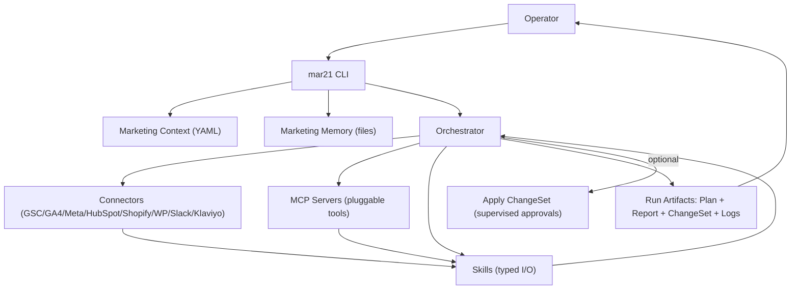

# mar21 Architecture

This document specifies the system decomposition and the *intended* repository layout for a TypeScript/Node monorepo.

`mar21` is **Codex-native + portable**:
- Codex can run skills and automations effectively.
- Portability is achieved by keeping the *stable surface* as file formats + interfaces (Context, Skill I/O, ChangeSet, Run Artifacts).

## High-level components
1) **CLI (`mar21`)**
   - Owns user interaction (init wizard, run selection, interactive approvals)
   - Produces run folders and artifacts

2) **Core Orchestrator**
   - Loads marketing context + memory
   - Resolves which skills to run for a goal
   - Coordinates connectors and writes ChangeSets

3) **Skills (code-first, typed I/O)**
   - Deterministic “units of marketing work”
   - May use LLMs internally, but always expose typed inputs/outputs

4) **Connectors**
   - **MCP-first:** prefers external tools via MCP servers (pluggable; discover tools at runtime)
   - May still include native connectors for “hard requirements” (e.g., extra safety/caching behavior)
   - Declare capabilities and risk (read-only vs write ops)
   - Support dry-run and rate limiting

5) **Run Artifacts + Memory**
   - `runs/` is the audit trail (inputs, outputs, logs, approvals, changeset)
   - `memory/` is the compounding knowledge base (learnings, winners/losers, exclusions)

## Data flow (run-based)


## MCP-first integration
`mar21` treats MCP as the default integration mechanism. This means:
- operators can add an MCP server “on the fly” per workspace (no mar21 release required)
- `mar21` still owns the safety layer (caps, approvals, evidence retention, audit trail)

See `docs/MCP.md`.

## Proposed monorepo layout (TypeScript/Node)
This is the opinionated layout `mar21` documentation assumes:

```
mar21/
  docs/
  packs/                  # optional: core + expansion packs (skills/workflows/templates)
  dist/                   # optional: exported bundles for distribution
  skills/                 # portable, tool-agnostic skill definitions
  workspaces/
    <workspace>/
      marketing-context.yaml
      memory/
      runs/
      secrets/
  packages/
    core/                 # orchestrator, run manager, artifact writers
    cli/                  # mar21 binary
    connectors/           # tool connectors
      gsc/
      ga4/
      meta-ads/
      hubspot/
      shopify/
      wordpress/
      slack/
      klaviyo/
    adapters/
      llm/                # provider-agnostic LLM interface + OpenAI adapter first
      codex/              # Codex-friendly adapters (optional)
  schemas/                # JSON Schemas for YAML/JSON artifacts (optional but recommended)
  examples/               # Example instances validated by schemas
```

## Scheduling / autopilot stance (built-in loop runner)
`mar21` assumes a **built-in loop runner** conceptually (even if users later run it under cron/CI):
- `mar21 run daily|weekly|monthly` executes a named loop once and produces artifacts.
- `mar21 autopilot start --profile daily` runs continuously, wakes on schedule, and emits one run per loop execution.
- Autopilot is still **supervised-by-default** unless a workspace explicitly allowlists operations.

Profiles are workspace-owned configuration (recommended):
- `workspaces/<workspace>/profiles/daily.yaml`
- `workspaces/<workspace>/profiles/weekly.yaml`
- `workspaces/<workspace>/profiles/monthly.yaml`

## Portability story
Portability is achieved by making these artifacts and interfaces the stable surface:
- `marketing-context.yaml`
- `skills/*/skill.yaml` (typed input/output contract)
- `changeset.yaml` (typed ops)
- `runs/<id>/**` (logs + artifacts)

Any agent runtime (Codex, a custom runner, another orchestrator) can implement:
- “load context”
- “execute skills”
- “produce Plan/Report/ChangeSet”
- “apply ChangeSet with approvals”

See also:
- `docs/CLI.md` (CLI contract)
- `docs/SCHEMAS.md` + `schemas/` (validation contract)
- `docs/connectors/README.md` (capability catalogs)
